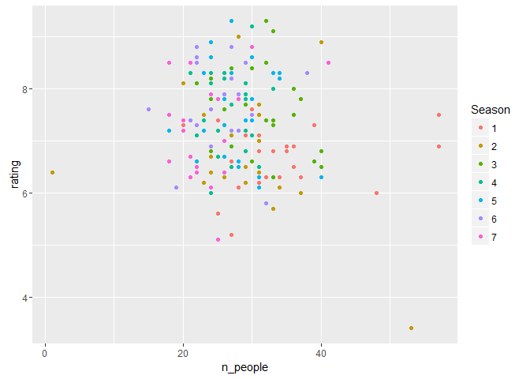

Star Trek The Next Generation Dataset
================

This README contains info about how to access the file, [disclaimer](#disclaimer), some use [cases](#usecases).

I'VE MOVED ALL STAR TREK RELATED STUFF TO A NEW GITHUB ORGANIZATION: [RTREK](https://github.com/rtrek)

- STAR TREK TNG [COMPLETE DATASET ](https://github.com/RTrek/startrekTNGdataset)
- STARTREK PACKAGE [WHERE YOU CAN TALK LIKE THE CHARACTERS](https://github.com/RTrek/startrekpackage)
- MORE ABOUT [THE DATASET](https://github.com/RTrek/TNG)


TLDR
====

This dataset contains all episodes of star trek TNG and has seperate rows for every speech or description that I found in the moviescripts. Install using `devtools::install_github("RMHogervorst/TNG")` or download the compressed csv file from raw-data folder. uncompressed the file is approx. 95.2 Mb.

Best results happen when you search using grep. because sometimes names are followed or preceded by spaces. for instance `PICARD` OR `PICARD` OR `PICARD V.O.`.

Licence public domain although the original scripts might not be.

Short intro
===========

This repo is r package and dataset of the sci-fi series Star Trek The Next Generation.

The dataset has 17 variables/columns and 110176 rows. variable names are here:

    [1] "episode"           "productionnumber"  "setnames"          "characters"       
    [5] "act"               "scenenumber"       "scenedetails"      "partnumber"       
    [9] "type"              "who"               "text"              "speechdescription"
    [13] "Released"          "Episode"           "imdbRating"        "imdbID"           
    [17] "Season"

Episode contains the name of the episode, productionnumber, setnames, and characters were scraped from the toppart of the moviescript. All scripts are divided up into partnumbers. A part can be a description or speech (as told by the TYPE variable). speech and descriptions over multiple lines is put together. ACT, SCENENUMBER, PARTNUMBER tell you what follows what and where in the episode this happened.

*The variables from Released to the Season are imports from my [IMDB package](https://github.com/RMHogervorst/imdb).*

for example in the episode New Ground somewhere in the episode a certain grubby crewmember confirms something...

    all_episodes_TNG[65305,]

has episode New Ground, production number \#40275-210 a bunch of sets and the following people in the cast:

PICARD,HELENA ROZHENKO,RIKER,ALEXANDER,DATA,MS. LOWRY,BEVERLY,ENSIGN FELTON,TROI,DOCTOR JA'DAR,GEORDI,WORF,Non-Speaking,SUPERNUMERARIES,SEVERAL BOYS,SEVERAL FATHERS,A SKULL-FACED ALIEN,WAITER

*As you can see Non-Speaking is not really a castmember. but describes the next people* That happens when you scrape text.

       act scenenumber scenedetails partnumber   type   who   text speechdescription
    1: ONE         6A                       95 speech  WORF  Good.             FALSE

And as you can see, WORF says "Good." in act one, scene 6a, partnumber 95. There is no description how Worf says this.

installation
------------

Install using `devtools::install_github("RMHogervorst/TNG")` or download the compressed csv file from raw-data folder. uncompressed the file is approx. 95.2 Mb.

Examples of explorations in this data set
=========================================

Let's start with some basic explorations.

number of speaking roles and ratings
------------------------------------

How many people are speaking in a episode?

Since I'm using dplyr the endresult will be a tbl\_df which prints nicer.

``` r
suppressMessages(library(dplyr))  
library(TNG)
TNG %>% group_by(episode) %>% distinct(who) %>% 
        summarize(n_people = n(), rating = mean(imdbRating)) %>% 
        arrange(desc(n_people), desc(rating) ) 
```

    ## Source: local data frame [175 x 3]
    ## 
    ##                    episode n_people rating
    ##                      (chr)    (int)  (dbl)
    ## 1                 11001001       57    7.5
    ## 2    encounter at farpoint       57    6.9
    ## 3           shades of gray       53    3.4
    ## 4                  justice       48    6.0
    ## 5       all good things...       41    8.5
    ## 6                   q who?       40    8.9
    ## 7  a matter of perspective       40    6.8
    ## 8     the vengeance factor       40    6.5
    ## 9               violations       40    6.3
    ## 10         the big goodbye       39    7.3
    ## ..                     ...      ...    ...

What is the relation between rating and number of speaking people? I will also add bit of color for season.

``` r
library(ggplot2)
TNG %>% group_by(episode) %>% distinct(who) %>% 
        summarize(n_people = n(), rating = mean(imdbRating), season = mean(Season)) %>% 
        arrange(desc(n_people), desc(rating) ) %>%
       ggplot(aes(n_people, rating, colour = Season)) + geom_point(aes(color = as.factor(season)) , na.rm = TRUE)
```

<!-- -->

The number of distinct speakers and rating all center around the same point, around 30 people and with ratings around 7.5.

I'm intrigued with the lowest rating.

``` r
TNG %>% group_by(episode) %>% distinct(who) %>% summarize( rating = mean(imdbRating)) %>% arrange( rating)
```

    ## Source: local data frame [175 x 2]
    ## 
    ##              episode rating
    ##                (chr)  (dbl)
    ## 1     shades of gray    3.4
    ## 2           sub rosa    5.1
    ## 3      code of honor    5.2
    ## 4          angel one    5.6
    ## 5          the child    5.7
    ## 6  man of the people    5.8
    ## 7            justice    6.0
    ## 8            manhunt    6.0
    ## 9           the loss    6.0
    ## 10            aquiel    6.1
    ## ..               ...    ...

It is episode *shades of gray*.

according to [wikipedia](https://en.wikipedia.org/wiki/Shades_of_Gray_%28Star_Trek:_The_Next_Generation%29)

> It was the only clip show filmed during the series and was created due to a lack of funds left over from other episodes during the season.

> "Shades of Gray" is widely regarded as the worst episode of the series, with critics calling it "god-awful" and a "travesty"; even Hurley referred to it negatively. It can be compared to "Spock's Brain" in The Original Series.

Right.

One character I found really annoying was Q.

In how many episodes is he really. Let's look at the character list in the dataset. Those episodes must by terrible.

``` r
TNG %>% group_by(episode) %>% filter(grepl(",Q,", characters)) %>% 
        summarize(rating = mean(imdbRating)) %>% knitr::kable(format = "html")
```

<table>
<thead>
<tr>
<th style="text-align:left;">
episode
</th>
<th style="text-align:right;">
rating
</th>
</tr>
</thead>
<tbody>
<tr>
<td style="text-align:left;">
all good things...
</td>
<td style="text-align:right;">
8.5
</td>
</tr>
<tr>
<td style="text-align:left;">
déjà q
</td>
<td style="text-align:right;">
8.5
</td>
</tr>
<tr>
<td style="text-align:left;">
q who?
</td>
<td style="text-align:right;">
8.9
</td>
</tr>
<tr>
<td style="text-align:left;">
qpid
</td>
<td style="text-align:right;">
7.4
</td>
</tr>
<tr>
<td style="text-align:left;">
tapestry
</td>
<td style="text-align:right;">
8.8
</td>
</tr>
<tr>
<td style="text-align:left;">
true q
</td>
<td style="text-align:right;">
7.5
</td>
</tr>
</tbody>
</table>
Well they're not. They belong to the best episodes of TNG.

Descriptions
------------

While I created this dataset I found that descriptions in the script are very nice

This is the first one:

> The U.S.S. Enterprise NCC 1701-D traveling at warp speed through space.

Which made me think, how many times is this description used? It feels as if the scene is used very often.

``` r
TNG %>% filter(type == "description") %>% filter(grepl("enterprise", text, ignore.case = TRUE), 
    grepl("warp speed", text, ignore.case = TRUE)) %>% select(text, Season) %>% 
    knitr::kable(format = "html")
```

<table>
<thead>
<tr>
<th style="text-align:left;">
text
</th>
<th style="text-align:right;">
Season
</th>
</tr>
</thead>
<tbody>
<tr>
<td style="text-align:left;">
The U.S.S. Enterprise NCC 1701-D traveling at warp speed through space.
</td>
<td style="text-align:right;">
1
</td>
</tr>
<tr>
<td style="text-align:left;">
With Enterprise in b.g. at warp speed, escaping. Then the 'grid' suddenly shrinks in size, growing brighter as it coalesces together INTO THE SHAPE OF A BRIGHTLY COLORED SPINNING SHAPE which now races after the Enterprise.
</td>
<td style="text-align:right;">
1
</td>
</tr>
<tr>
<td style="text-align:left;">
The faces of the bridge crew reflect the fact that Enterprise is at very high warp speed and continuing to accelerate into even higher warp.
</td>
<td style="text-align:right;">
1
</td>
</tr>
<tr>
<td style="text-align:left;">
A DOT OF LIGHT becomes a starship, as the USS Enterprise rockets directly TOWARD CAMERA, driving hard at warp speed... in chase.
</td>
<td style="text-align:right;">
1
</td>
</tr>
<tr>
<td style="text-align:left;">
The "cloud" in far b.g. as WE SEE the Enterprise go into WARP SPEED EFFECT.
</td>
<td style="text-align:right;">
1
</td>
</tr>
<tr>
<td style="text-align:left;">
He looks at her. Then -- before he can answer, the Enterprise leaps to warp speed. The star field becomes a spectacular display. We PLAY THE REACTIONS of Guinan and Wesley.
</td>
<td style="text-align:right;">
2
</td>
</tr>
<tr>
<td style="text-align:left;">
as the Enterprise stretches to warp speed.
</td>
<td style="text-align:right;">
2
</td>
</tr>
<tr>
<td style="text-align:left;">
The Enterprise takes off, moving OUT OF FRAME at warp speed. HOLD on Praxillus. Beat; then the star EXPLODES in a nova-like reaction.
</td>
<td style="text-align:right;">
4
</td>
</tr>
<tr>
<td style="text-align:left;">
The Test Ship is ahead of the Enterprise, traveling at warp speed. There should be a slight DISTORTION effect around the ship from the Soliton Wave.
</td>
<td style="text-align:right;">
5
</td>
</tr>
<tr>
<td style="text-align:left;">
The Enterprise at warp speed across a field of stars.
</td>
<td style="text-align:right;">
6
</td>
</tr>
</tbody>
</table>
Not that often it seems.

How often does picard drink tea....
-----------------------------------

 Found at: <https://www.heatherbuchanan.ca/products/captain-picard-tea-earl-grey-hot-greeting-card>

Picard seems to drink a lot of earl grey tea.

in fact someone did a montage of [all the time he orders it](https://www.youtube.com/watch?v=R2IJdfxWtPM)

``` r
TNG %>% filter(grepl("PICARD", who), grepl(" tea ", text)) %>% select(who, text, Season, act) %>% knitr::kable(format = "html")
```

<table>
<thead>
<tr>
<th style="text-align:left;">
who
</th>
<th style="text-align:left;">
text
</th>
<th style="text-align:right;">
Season
</th>
<th style="text-align:left;">
act
</th>
</tr>
</thead>
<tbody>
<tr>
<td style="text-align:left;">
PICARD
</td>
<td style="text-align:left;">
At first I couldn't figure out why your house had survived the holocaust while all the others hadn't. And then it occurred to me that it had been destroyed. The dwelling where you served me tea and danced your waltzes was a reproduction, something real to the touch but capable of being created and destroyed and recreated at whim.
</td>
<td style="text-align:right;">
3
</td>
<td style="text-align:left;">
FIVE
</td>
</tr>
<tr>
<td style="text-align:left;">
PICARD
</td>
<td style="text-align:left;">
Ginger tea with honey, very hot.
</td>
<td style="text-align:right;">
5
</td>
<td style="text-align:left;">
ONE
</td>
</tr>
<tr>
<td style="text-align:left;">
PICARD
</td>
<td style="text-align:left;">
May I offer you some tea or --
</td>
<td style="text-align:right;">
6
</td>
<td style="text-align:left;">
TEASER
</td>
</tr>
<tr>
<td style="text-align:left;">
PICARD
</td>
<td style="text-align:left;">
It's an herbal tea blend... I came across it in the replicator files.
</td>
<td style="text-align:right;">
6
</td>
<td style="text-align:left;">
ONE
</td>
</tr>
</tbody>
</table>
That's weird. In the original scripts there is little to no mentioning of earl grey tea. In fact when I search for the exact phrase it only happens seven times.

``` r
grep("Tea. Earl Grey. Hot", TNG$text, value = TRUE, ignore.case = TRUE)
```

    ## [1] " Tea, Earl Grey, hot."                                                                 
    ## [2] " Tea. Earl Grey. Hot. Have you been able to determine the cause of our transformation?"
    ## [3] " Tea, Earl Grey. Hot."                                                                 
    ## [4] " One tea, Earl Grey, hot. One macchiato."                                              
    ## [5] " Tea, Earl Grey, hot."                                                                 
    ## [6] " Tea? Earl Grey. Hot."                                                                 
    ## [7] " Tea. Earl Grey. Hot."

### disclaimer

I haven't checked everything and I had some errors during the construction, so some scripts are not complete and some parts are perhaps wrongly classified as speech or description.

The creation of the dataset took me 15 hours and linking it to the IMDB database and creating this package took me another 4 hours.

### Resources

I've dowloaded all the files from <http://www.st-minutiae.com/resources/scripts/>

And discovered that the scripts (mostly...) follow a convention of

-   one tab for descriptions
-   three tabs for what people say
-   five tabs for who says things
-   etc

I have used the packages dplyr and readr.

### Licence

My dataset is CC0 PUBLIC domain.

I'm very curious to see your analyses of TNG. Enjoy

Roel M. Hogervorst

2016-3-27
